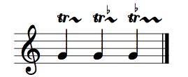
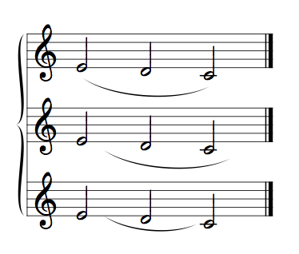

# Guido Engine Version 1.6.5

Documentation of the new features and syntax change or extensions since release 1.5.4.

### Summary
- [Version 1.5.5](#154)
- [Version 1.5.6](#156)
- [Version 1.6.1](#161)
- [Version 1.6.3](#163)
- [Version 1.6.4](#164)
- [Version 1.6.5](#165)

----------------------------------------------------------------

### Changes with version 1.5.5

- color param added for tags: `\tremolo, \dotFormat, \accidental, \accolade, \bar, \doubleBar, \endBar, \repeatBegin, \repeatEnd, \daCapo, \daCapoAlFine, \dalSegno, \dalSegnoAlFine, \fine, \breathMark, \key, \octava, \staffFormat, \tempo, \tie, \tuplet, \volta`
- size param added for tags: `\accolade, \bar`
- \volta-tag:
	- 'm' param changed to 'mark'

----------------------------------------------------------------

### Changes with version 1.5.6

- `\special` tag:
    - "space" param removed (useless)
    - "scale" param changed for "size"
    - "color" param added
- `\tuplet` tag:
    - "position" param added. Values: "above" | "below".
    - "dx" param added 

----------------------------------------------------------------

#### Changes with version 1.6.1

- new `\beamsFull` tag: allows rests in auto beaming

----------------------------------------------------------------

#### Changes with version 1.6.3

- new style "none" for `\acc` tag, intended to avoid the second accidental in case of tied notes  
- articulations support a position parameter with "above" or "below" values
- autoMeasuresNum attribute of the `\meter` tag supports "page" value
- new 'enclosure' parameter for `\mark` tag (see sample gmn files)

-----------------------------

#### Changes with version 1.6.4

- new `\staffFormat` "distance" parameter for fixed stave spacing feature
- `\instr` tag supports font attributes (font, size, format...) and auto position
  using the "autopos" attribute or using the `\auto` or `\set` tag
- new "autoInstrPos" attribute for the `\set` tag
- new `\harmony` tag
- new "autopos" attribute for dynamics (`\cresc` and `\dim`)
- support for `\clef<"c0">`
- new "repeat" attribute for `\trills`
- new "autoLyricsPos" attribute for the `\set` tag

-----------------------------

#### Changes with version 1.6.5

- ornaments syntax change (affects `\trill`, `\mordent`, `\turn`): they don't use a chord for specification any more, but can be applied to (real) chord. Tag parameters have been redesigned. Example:  
<pre>[\trill(g) \trill<"a&">(g) \trill<"a&", ady=0.5, adx=-2>(g) ]</pre>

- `\slurs`: "dx[1|2]" and "dy[1|2]" are now taken into account when curve direction (up | down) is set, "dx" and "dy" are now applied as offsets to dx1, dx2 and dy1, dy2. Example:
<pre>{
  [\slur(e/2 d c ) ],
  [\slur&lt;dx=5, dy=-2>;(e/2 d c ) ],
  [\slur&lt;dx1=5,dx2=-3>(e/2 d c ) ]
}</pre>

