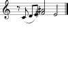
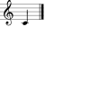
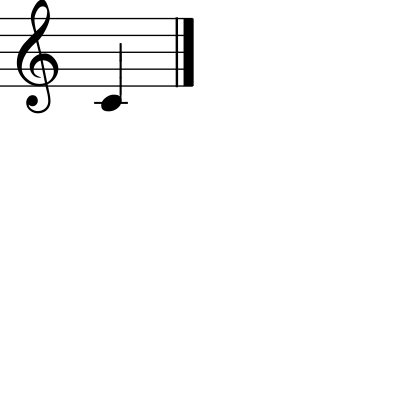
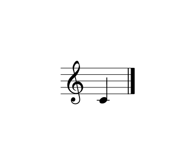
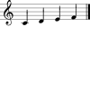

API
===

This page provides all of the calls avaiable in the GUIDOEngine web
API.  For all of the examples below, we assume that the base URL
of the server is ``http://guido.grame.fr`` running on port ``8000``.

Data types
----------

.. index::
  single: Date

In addition to standard data types such as integers, floats and strings,
two data types internal to the GUIDOEngine are represented in JSON.  The
first, called a ``Date``, is expressed as a rational number with a
numerator and denominator.  In the example below, ``begintime`` is a ``Date``::

  {
          "begintime": {
                  "num": 1,
                  "denom": 2
          }
  }

.. index::
  single: FloatRec

``FloatRect`` objects are also represented.  A ``FloatRect`` is a rectangle
defined by its ``top`` and ``bottom`` points on the Y axis and its ``left``
and ``right`` points on the X axis.  In the example below, ``floatrec``
is a ``Floatrec``::

  {
          "floatrec": {
                  "left": 297.292,
                  "right": 400,
                  "top": 0,
                  "bottom": 129.887
          }
  }

.. index::
  single: Setters

Setter calls
------------

.. index::
  single: Set GMN

GMN
^^^

The following call passes in Guido Music Notation code to the server
that will be visualized::

  <html>
    <body>
      <form action="http://guido.grame.fr:8000" method="post">
        <input type="hidden" name="data" value='{ "gmn" : "[ _/8 \slur(c1 d e) {fis/2, ais} e/2 ]" }' />
        <input type="submit" value="Submit" />
      </form>
    </body>
  </html>

::

  curl -d "data={ \"gmn\" : \"[ _/8 \slur(c1 d e) {fis/2, ais} e/2 ]\" }" http://guido.grame.fr:8000/ > setGmn.png

Resulting in:

Values must be valid GMN.

.. index::
  single: Set page

Page
^^^^

The following call sets the page to be displayed::

  <html>
    <body>
      <form action="http://guido.grame.fr:8000" method="post">
        <input type="hidden" name="data" value='{ "page" : "1" }' />
        <input type="submit" value="Submit" />
      </form>
    </body>
  </html>

::

  curl -d "data={ \"page\" : \"1\" }" http://guido.grame.fr:8000/ > setPage.png

Resulting in:

Values must be integer values greater than 0.

.. index::
  single: Set width

Width
^^^^^

The following call sets the width of the page::

  <html>
    <body>
      <form action="http://guido.grame.fr:8000" method="post">
        <input type="hidden" name="data" value='{ "width" : "800" }' />
        <input type="submit" value="Submit" />
      </form>
    </body>
  </html>

::

  curl -d "data={ \"width\" : \"800\" }" http://guido.grame.fr:8000/ > setWidth.png

Resulting in:

Values must be floating point or integer values greater than 0.

.. index::
  single: Set height

Height
^^^^^^

The following call sets the height of the page::

  <html>
    <body>
      <form action="http://guido.grame.fr:8000" method="post">
        <input type="hidden" name="data" value='{ "height" : "800" }' />
        <input type="submit" value="Submit" />
      </form>
    </body>
  </html>

::

  curl -d "data={ \"height\" : \"800\" }" http://guido.grame.fr:8000/ > setHeight.png

Resulting in:

Values must be floating point or integer values greater than 0.

.. index::
  single: Set left margin

Left margin
^^^^^^^^^^^

The following call sets the left margin of the page::

  <html>
    <body>
      <form action="http://guido.grame.fr:8000" method="post">
        <input type="hidden" name="data" value='{ "marginleft" : "10" }' />
        <input type="submit" value="Submit" />
      </form>
    </body>
  </html>

::

  curl -d "data={ \"marginleft\" : \"10\" }" http://guido.grame.fr:8000/ > setMarginleft.png

Resulting in:

.. image:: setMarginleft.png

Values must be floating point or integer values greater than 0.

.. index::
  single: Set right margin

Right margin
^^^^^^^^^^^^

The following call sets the right margin of the page::

  <html>
    <body>
      <form action="http://guido.grame.fr:8000" method="post">
        <input type="hidden" name="data" value='{ "marginright" : "10" }' />
        <input type="submit" value="Submit" />
      </form>
    </body>
  </html>

::

  curl -d "data={ \"marginright\" : \"10\" }" http://guido.grame.fr:8000/ > setMarginright.png

Resulting in:

.. image:: setMarginright.png

Values must be floating point or integer values greater than 0.

.. index::
  single: Set top margin

Top margin
^^^^^^^^^^

The following call sets the top margin of the page::

  <html>
    <body>
      <form action="http://guido.grame.fr:8000" method="post">
        <input type="hidden" name="data" value='{ "margintop" : "10" }' />
        <input type="submit" value="Submit" />
      </form>
    </body>
  </html>

::

  curl -d "data={ \"margintop\" : \"10\" }" http://guido.grame.fr:8000/ > setMargintop.png

Resulting in:

.. image:: setMargintop.png

Values must be floating point or integer values greater than 0.

.. index::
  single: Set bottom margin

Bottom margin
^^^^^^^^^^^^^

The following call sets the bottom margin of the page::

  <html>
    <body>
      <form action="http://guido.grame.fr:8000" method="post">
        <input type="hidden" name="data" value='{ "marginbottom" : "10" }' />
        <input type="submit" value="Submit" />
      </form>
    </body>
  </html>

::

  curl -d "data={ \"marginbottom\" : \"10\" }" http://guido.grame.fr:8000/ > setMarginbottom.png

Resulting in:

Values must be floating point or integer values greater than 0.

.. index::
  single: Set zoom

Zoom
^^^^

The following call sets the zoom of the page::

  <html>
    <body>
      <form action="http://guido.grame.fr:8000" method="post">
        <input type="hidden" name="data" value='{ "zoom" : "4" }' />
        <input type="submit" value="Submit" />
      </form>
    </body>
  </html>

::

  curl -d "data={ \"zoom\" : \"4\" }" http://guido.grame.fr:8000/ > setZoom.png

Resulting in:

.. image:: setZoom.png

Values must be floating point or integer values greater than 0.

.. index::
  single: Set resizepagetomusic

Resize page to music
^^^^^^^^^^^^^^^^^^^^

The following call tells the web server to resize the page to the music it
contains::

  <html>
    <body>
      <form action="http://guido.grame.fr:8000" method="post">
        <input type="hidden" name="data" value='{ "resizepagetomusic" : "true" }' />
        <input type="submit" value="Submit" />
      </form>
    </body>
  </html>

::

  curl -d "data={ \"resizepagetomusic\" : \"true\" }" http://guido.grame.fr:8000/ > setResizepagetomusic.png

Resulting in:

Values must be either ``true`` or ``false``.

.. index::
  single: Set format

Format
^^^^^^^^^^^^^^^^^^^^

The following call tells the web server change the format of the output::

  <html>
    <body>
      <form action="http://guido.grame.fr:8000" method="post">
        <input type="hidden" name="data" value='{ "format" : "jpg" }' />
        <input type="submit" value="Submit" />
      </form>
    </body>
  </html>

::

  curl -d "data={ \"format\" : \"jpg\" }" http://guido.grame.fr:8000/ > setFormat.jpg

Resulting in:

Values must be either ``jpg``, ``gif`` or ``png``.

.. index::
  single: Getters

Getter calls
------------

Getters for all setters
^^^^^^^^^^^^^^^^^^^^^^^

All setter calls above have equivalent getter calls in the form ``get=attribute``.
The GET calls are written variable for variable in the URL and
not in JSON.  For example:

.. parsed-literal::
  `http://guido.grame.fr:8000/?get=gmn <http://guido.grame.fr:8000/?get=gmn>`_

Returns::

  {
          "gmn": "[c]"
  }

As a reminder, the available values for ``get`` corresponding to setter methods:

- gmn
- page
- width
- height
- marginleft
- marginright
- margintop
- marginbottom
- zoom
- resizepagetomusic
- format

Maps may be gotten as well.  A map in guido takes a musical entity (a page,
staff, voice or system) are returns a map describing the objects in that
entity.  The map maps beginning and end times (both represented as ``Date``)
to the graphical bounding box of the object represented by a ``FloatRectangle``.

.. _page-map:

.. index::
  single: Get page map

Page map
^^^^^^^^

A page map in Gudio describes the begin and end times of a page as well as
the bounding box of the entire musical content on the page (meaning one
bounding box that groups together all musical objects).  The page value as
well as the GMN are the ones set via previous calls to the server (or
default values if none were set).

The call:

.. parsed-literal::
  `http://guido.grame.fr:8000/?gmn=[a b c]&page=1&get=pagemap <http://guido.grame.fr:8000/?gmn=[a%20b%20c]&page=1&get=pagemap>`_

Returns::

  {
          "pagemap": [
                  {
                          "begintime": {
                                  "num": 0,
                                  "denom": 1
                          },
                          "endtime": {
                                  "num": 3,
                                  "denom": 4
                          },
                          "floatrec": {
                                  "left": 0,
                                  "right": 307.959,
                                  "top": 0,
                                  "bottom": 100
                          }
                  }
          ]
  }

.. index::
  single: Get system map

System map
^^^^^^^^^^

A system map in Gudio describes the begin and end times of a system as well as
the bounding box of the events on the system.  The page value as well
as the GMN are the ones set via previous calls to the server (or default
values if none were set).

The call:

.. parsed-literal::
  `http://guido.grame.fr:8000/?gmn=[a b c]&page=1&get=systemmap <http://guido.grame.fr:8000/?gmn=[a%20b%20c]&page=1&get=systemmap>`_

Returns::

  {
          "systemmap": [
                  {
                          "begintime": {
                                  "num": 0,
                                  "denom": 1
                          },
                          "endtime": {
                                  "num": 1,
                                  "denom": 4
                          },
                          "floatrec": {
                                  "left": 88.3824,
                                  "right": 158.634,
                                  "top": 0,
                                  "bottom": 100
                          }
                  },
                  {
                          "begintime": {
                                  "num": 1,
                                  "denom": 4
                          },
                          "endtime": {
                                  "num": 1,
                                  "denom": 2
                          },
                          "floatrec": {
                                  "left": 158.634,
                                  "right": 228.885,
                                  "top": 0,
                                  "bottom": 100
                          }
                  },
                  {
                          "begintime": {
                                  "num": 1,
                                  "denom": 2
                          },
                          "endtime": {
                                  "num": 3,
                                  "denom": 4
                          },
                          "floatrec": {
                                  "left": 228.885,
                                  "right": 307.959,
                                  "top": 0,
                                  "bottom": 100
                          }
                  }
          ]
  }

.. index::
  single: Get staff map

Staff map
^^^^^^^^^

A staff map in Gudio describes the begin and end times of a staff
in a system as well as the bounding box of the events in the staff.
The page value as well as the GMN are the ones set via previous
calls to the server (or default values if none were set). The
desired staff must be explicitly defined via ``staff``. Staves are
indexed from the top to the bottom of a system. Below, we choose the
first (and only) staff in the score.

.. parsed-literal::
  `http://guido.grame.fr:8000/?gmn=[a b c]&page=1&get=staffmap&staff=1 <http://guido.grame.fr:8000/?gmn=[a%20b%20c]&page=1&get=staffmap&staff=1>`_

Returns::

  {
          "staffmap": [
                  {
                          "begintime": {
                                  "num": 0,
                                  "denom": 1
                          },
                          "endtime": {
                                  "num": 1,
                                  "denom": 4
                          },
                          "floatrec": {
                                  "left": 88.3824,
                                  "right": 158.634,
                                  "top": 16.1765,
                                  "bottom": 75
                          }
                  },
                  {
                          "begintime": {
                                  "num": 1,
                                  "denom": 4
                          },
                          "endtime": {
                                  "num": 1,
                                  "denom": 2
                          },
                          "floatrec": {
                                  "left": 158.634,
                                  "right": 228.885,
                                  "top": 16.1765,
                                  "bottom": 75
                          }
                  },
                  {
                          "begintime": {
                                  "num": 1,
                                  "denom": 2
                          },
                          "endtime": {
                                  "num": 3,
                                  "denom": 4
                          },
                          "floatrec": {
                                  "left": 228.885,
                                  "right": 307.959,
                                  "top": 16.1765,
                                  "bottom": 75
                          }
                  }
          ]
  }

.. _voice-map:

.. index::
  single: Get voice map

Voice map
^^^^^^^^^

A voice map in Gudio describes the begin and end times of a voice
in a staff as well as the bounding box of the events in the voice.
The page value as well as the GMN are the ones set via previous
calls to the server (or default values if none were set). The
desired voice must be explicitly defined via ``voice``. Staves are
indexed from the top to the bottom of a system. Below, we choose the
first (and only) voice in the score.

.. parsed-literal::
  `http://guido.grame.fr:8000/?gmn=[a b c]&page=1&get=voicemap&voice=1 <http://guido.grame.fr:8000/?gmn=[a%20b%20c]&page=1&get=voicemap&voice=1>`_

Returns::

  {
          "voicemap": [
                  {
                          "begintime": {
                                  "num": 0,
                                  "denom": 1
                          },
                          "endtime": {
                                  "num": 1,
                                  "denom": 4
                          },
                          "floatrec": {
                                  "left": 88.3824,
                                  "right": 106.029,
                                  "top": 45.5882,
                                  "bottom": 60.2941
                          }
                  },
                  {
                          "begintime": {
                                  "num": 1,
                                  "denom": 4
                          },
                          "endtime": {
                                  "num": 1,
                                  "denom": 2
                          },
                          "floatrec": {
                                  "left": 158.634,
                                  "right": 176.281,
                                  "top": 38.2353,
                                  "bottom": 52.9412
                          }
                  },
                  {
                          "begintime": {
                                  "num": 1,
                                  "denom": 2
                          },
                          "endtime": {
                                  "num": 3,
                                  "denom": 4
                          },
                          "floatrec": {
                                  "left": 228.885,
                                  "right": 246.532,
                                  "top": 82.3529,
                                  "bottom": 97.0588
                          }
                  }
          ]
  }

.. _get-point:

.. index::
  single: Get point

Point
^^^^^
For a given map, one can ask the GUIDOEngine Web Server ''Is there an event
at a given point with coordinates ``x`` and ``y`` and the events in map ``map``?''
``x`` and ``y`` are floating-point numbers and ``map`` is one of four maps:
``page``, ``system``, ``voice`` and ``staff``.  Like the map calls above,
``voice`` and ``staff`` must be followed by a ``voice`` or ``staff`` argument
indicating the desired voice or staff. The syntax is:

.. parsed-literal::
  `http://guido.grame.fr:8000/?gmn=[a b c]&page=1&get=point&x=300&y=80&map=system <http://guido.grame.fr:8000/?gmn=[a%20b%20c]&page=1&get=point&x=300&y=80&map=system>`_

Or, for an equivalent result using the voice map:

.. parsed-literal::
  `http://guido.grame.fr:8000/?gmn=[a b c]&page=1&get=point&x=300&y=80&map=voice&voice=1 <http://guido.grame.fr:8000/?gmn=[a%20b%20c]&page=1&get=point&x=300&y=80&map=voice&voice=1>`_

Resulting in::

  {
          "point": {
                  "begintime": {
                          "num": 1,
                          "denom": 2
                  },
                  "endtime": {
                          "num": 3,
                          "denom": 4
                  },
                  "floatrec": {
                          "left": 297.292,
                          "right": 400,
                          "top": 0,
                          "bottom": 129.887
                  }
          }
  }

.. index::
  single: DELETE

Deleting scores
---------------

Scores may be deleted by using the DELETE RESTful web method. If one creates
the score::

  <html>
    <body>
      <form action="http://guido.grame.fr:8000/ensemble101" method="post">
        <input type="hidden" name="data" value='{ "gmn" : "[c d e f]" }' />
        <input type="submit" value="Submit" />
      </form>
    </body>
  </html>

::

  curl -d "data={ \"gmn\" : \"[c d e f]\" }" http://guido.grame.fr:8000/ensemble101 > cdef.png

Returning:

It may be deleted as such::

  curl -X DELETE http://guido.grame.fr:8000/ensemble101