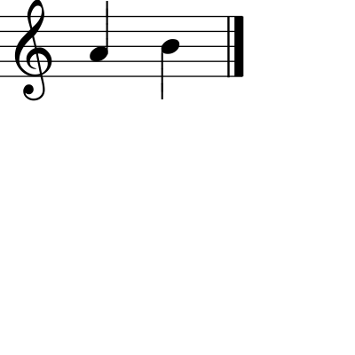

Overview
===============================================

This page provides an overview of certain key concepts in the GUIDOEngine
Web API.  For all of the examples below, we assume that the base URL
of the server is ``http://faust.grame.fr`` running on port ``8000``.

.. index::
   single: GUIDO Music Notation
   single: GUIDO Music Engine

GUIDO Music Notation
--------------------

The GUIDO Music Notation Format is a formal language for score level music representation. It is a plain-text, i.e. readable and platform independent format capable of representing all information contained in conventional musical scores. The basic GUIDO Format is very flexible and can be easily extended and adapted to capture a wide variety of musical features beyond conventional musical notation (CMN). The GUIDO design is strongly influenced by objective oriented programming to facilitate an adequate representation of musical material, from tiny motives up to complex symphonic scores.

GUIDO is a general purpose musical notation format; the intended range of application includes notation software, compositional and analytical systems and tools, performance systems, and large musical databases. It is powerful, flexible, easily portable, and human readable. 

More about the GUIDO Engine Library and the GUDIO Music Notation Format can
be found on the `GUIDO Sourceforge page <http://guidolib.sourceforge.net/>`_.

.. index::
   single: Server calls

Basic server calls
------------------

To interpret Gudio Music Notation (hereafter refered to as ``gmn``) code ``gmn=[a b c d]``, one makes
the following call to the Guido Web Server:

.. parsed-literal::
  `http://faust.grame.fr:8000/?gmn=[a%20b%20c%20d] <http://faust.grame.fr:8000/?gmn=[a%20b%20c%20d]>`_

The output will use GUIDO server default settings for page and formatting
attributes (discussed in :ref:`defaults`), creating the result:

.. image:: abcd.png

.. note::

   Correct URLs use %20 for whitespace.  However, most modern browsers
   will still interpret whitespace in a URL with whitespace.  For example,
   in most modern browsers, you can call:

     .. parsed-literal::
        `http://faust.grame.fr:8000/?gmn=[a b c d] <http://faust.grame.fr:8000/?gmn=[a%20b%20c%20d]>`_

   And it will get you a correct result.

It is sometimes the case that a call to the Guido Web Server needs additional
arguments.  For example, to get a :ref:`page map <page-map>`, the page in question must be
specified.  This is done by appending those arguments to the URL.

.. parsed-literal::
  `http://faust.grame.fr:8000/?get=voicemap&voice=1 <http://faust.grame.fr:8000/?get=voicemap&voice=1>`_

Resulting in::

  {
          "voicemap": [
                  {
                          "begintime": {
                                  "num": 0,
                                  "denom": 1
                          },
                          "endtime": {
                                  "num": 1,
                                  "denom": 4
                          },
                          "floatrec": {
                                  "left": 211.116,
                                  "right": 253.269,
                                  "top": 196.714,
                                  "bottom": 231.842
                          }
                  }
          ]
  }

.. index::
   single: Multiple arguments

For calls that require multiple arguments, the arguments can appear in any
order.  For example, :ref:`getting a point <get-point>` requires three arguments
and needs a potential fourth as well depending on the previous three.
The three necessary arguments ``x`` and ``y`` coordinate for the point as well as a ``map`` argument.
A fourth argument is required as well if ``map`` is equal to ``voice`` or
``staff``. This can be written either as:

.. parsed-literal::
  `http://faust.grame.fr:8000/?get=point&y=200&x=220&map=voice&voice=1 <http://faust.grame.fr:8000/?get=point&y=200&x=220&map=voice&voice=1>`_

or:

.. parsed-literal::
  `http://faust.grame.fr:8000/?get=point&x=220&map=voice&voice=1&y=200 <http://faust.grame.fr:8000/?get=point&x=220&map=voice&voice=1&y=200>`_

Resulting in::

  {
          "point": {
                  "begintime": {
                          "num": 0,
                          "denom": 1
                  },
                  "endtime": {
                          "num": 1,
                          "denom": 4
                  },
                  "floatrec": {
                          "left": 211.116,
                          "right": 253.269,
                          "top": 196.714,
                          "bottom": 231.842
                  }
          }
  }

.. index::
   single: Server responses

Server responses
----------------

The server responds with two forms of data: graphical data and textual data.
Graphical data will have a MIME type of ``image/png``, ``image/jpeg``,
``image/gif`` or ``image/svg+xml`` depending on the format specified in
the URL.  Textual data will always be returned in JSON and thus the MIME
type is ``application/json``.

.. index::
   single: Multiple server calls

Multiple server calls in a single URL
-------------------------------------

All server calls in a single URL apply to the same GRHandler. This will
either be an anonymous handler or a named handler, as discussed in the
section :ref:`anon-named`.

Multiple calls are interpreted from left to right. The server responds to the
last valid call. All extra arguments for a given call to a server must be
specified immediately after the call.  So :ref:`getting the voice map <voice-map>`:

.. parsed-literal::
  `http://faust.grame.fr:8000/?gmn=[a%20b]&get=voicemap&voice=1 <http://faust.grame.fr:8000/?gmn=[a%20b]&get=voicemap&voice=1>`_

Will return::

  {
          "voicemap": [
                  {
                          "begintime": {
                                  "num": 0,
                                  "denom": 1
                          },
                          "endtime": {
                                  "num": 1,
                                  "denom": 4
                          },
                          "floatrec": {
                                  "left": 148.724,
                                  "right": 178.419,
                                  "top": 76.7129,
                                  "bottom": 101.459
                          }
                  },
                  {
                          "begintime": {
                                  "num": 1,
                                  "denom": 4
                          },
                          "endtime": {
                                  "num": 1,
                                  "denom": 2
                          },
                          "floatrec": {
                                  "left": 266.938,
                                  "right": 296.634,
                                  "top": 64.3399,
                                  "bottom": 89.086
                          }
                  }
          ]
  }

By reversing the calls:

.. parsed-literal::
  `http://faust.grame.fr:8000/?get=voicemap&voice=1&gmn=[a%20b] <http://faust.grame.fr:8000/?get=voicemap&voice=1&gmn=[a%20b]>`_

We receive:

Note that the number of notes reported to the map is different in the
two calls. In the first, the map corresponds to the previously specified
gmn code ``gmn=[a%20b]``, whereas in the second example the
``get=voicemap`` applies to the default ``gmn`` (``[a]``),
as no ``gmn`` has been specified yet. However, as this result is not reported
back (only the image is reported back as it is the last requested
object), there is no visual confirmation that this is the case.

.. index::
   single: GET
   single: POST

GET and POST calls to the server
--------------------------------

The server receives both GET and POST calls.

.. index::
   single: Corrupt URLs

Corrupt URLs
------------

Corrupt URLs for the GUIDOEngine Web Server come in many shapes and sizes.

- URLs that are malformed and thus unparseable.
- URLs that specify inexistent arguments.
- URLs that pass erroneous variables to arguments.
- URLs that do not pass enough arguments for a given request.

In all of these cases, if the web server encounters an argument that it
cannot parse in full, it will ignore it and move to the next one. So,
for example:

.. parsed-literal::
  `http://faust.grame.fr:8000/?get=point&y=200&x=220&map=voice <http://faust.grame.fr:8000/?get=point&y=200&x=220&map=voice>`_

Will fail because it does not specify a voice and will return::

  {
          "error": "You have entered insane input."
  }

On the other hand:

.. parsed-literal::
  `http://faust.grame.fr:8000/?get=point&y=200&x=220&map=voice&gmn=[c c c] <http://faust.grame.fr:8000/?get=point&y=200&x=220&map=voice&gmn=[c c c]>`_

Will fail for the first call but succeed for the second, returning:

.. image:: ccc.png

.. index::
   single: Anonymous session
   single: Named session

.. _anon-named:

Anonymous versus named sessions
-------------------------------

A named session is created by inserting a name composed of only letters and
numbers in between the base URL of the Guido server and the subsequent
arguments (if any).  For example, we can instantiate the named session
for name ``ensemble101`` with ``gmn=[a b c d]`` by calling:

.. parsed-literal::
  `http://faust.grame.fr:8000/ensemble101?gmn=[c d e f] <http://faust.grame.fr:8000/ensemble101?gmn=[c d e f]>`_

Returning:

.. image:: cdef.png

When a named session is created, a GRHandler object is created that corresponds
to the session's name.  This GRHandler retains all information about that
session.  So, for example, if one calls:

.. parsed-literal::
  `http://faust.grame.fr:8000/ensemble101?get=gmn <http://faust.grame.fr:8000/ensemble101?get=gmn>`_

The result will be::

  {
          "username": "ensemble101",
          "gmn": "[c d e f]"
  }
