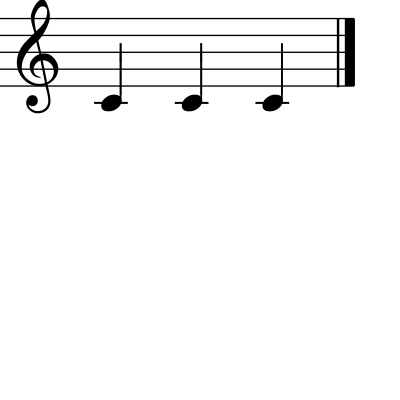

Overview
===============================================

This page provides an overview of certain key concepts in the GUIDOEngine
Web API.  For all of the examples below, we assume that the base URL
of the server is ``http://guido.grame.fr`` running on port ``8000``.

.. index::
   single: GUIDO Music Notation
   single: GUIDO Music Engine

Documentation conventions
-------------------------

All POST commands in this document are shown in two ways:

* a bloc showing the html of the link
* a curl command

All GET calls are given as clickable hyperlinks. All DELETE commands are given as curl
examples.

Users should be able to run all commands verbatim and get the result shown on the
website. If any discrepencies occur, please contact
`mike at mikesolomon dot org <mailto:mike@mikesolomon.org>`_.

GUIDOEngine and REST
--------------------

The GUIDOEngine implements four of the five methods required for a server to be RESTful.

1. Client–server
................

The GUIDOEngine server is entirely agnostic of the clients that connect to it - anyone
can connect to the server via any device that transmits HTTP messages such as a browser
or curl.

2. Cacheable
............

The GUIDOEngine server caches all cacheable data such as page sizes, notes in a score
and output formats.

3. Layered system
.................

The REST standard dictates that clients should not know whether they are connected
to an end server or to intermediaries. As there is no notion of intermediary server
in the GUIDOEngine architecture, this part of the specification does not concern
the server.

4. Uniform interface
....................

The principle of uniformity of resources dictates that all resources should be
identifiable by the messages sent about them and that these messages should be
able to describe the manipulations that happen on these objects. The system of
naming in the GUIDO server implements this.

.. index::
   single: Anonymous session
   single: Named session

The GUIDOEngine does not implement a **Stateless** server (the 5th requirement for
a RESTful server) insofar as the server retains information about named scores.
A named score is created by inserting
a name composed of only letters and numbers in between the base URL of the
Guido server and the subsequent arguments (if any).  For example, we can
instantiate the named score for name ``ensemble101`` with ``gmn=[a b c d]`` like so::

  <html>
    <body>
      <form action="http://guido.grame.fr:8000/ensemble101" method="post">
        <input type="hidden" name="data" value='{ "gmn" : "[c d e f]" }' />
        <input type="submit" value="Submit" />
      </form>
    </body>
  </html>

::

  curl -d "data={ \"gmn\" : \"[c d e f]\" }" http://guido.grame.fr:8000/ensemble101 > cdef.png

Returning:

.. image:: cdef.png

When a named score is created, an internal object on the server is created that
corresponds to the score's name.  This object retains all information about that
score.  So, for example, if one calls:

.. parsed-literal::
  `http://guido.grame.fr:8000/ensemble101?get=gmn <http://guido.grame.fr:8000/ensemble101?get=gmn>`_

The result will be::

  {
          "username": "ensemble101",
          "gmn": "[c d e f]"
  }

Lastly, GUIDOEngine implements three of the four methods of a RESTful web service - GET,
POST, and DELETE. GET is used to retrieve data from the server. POST is used to modify the
contents of the server. DELETE is used to remove a score (or a collection URI in RESTful
teerms) from the server. The one remaining method of a RESTful web service --- PUT ---
is never used by the GUIDOEngine web server. PUT replaces the contents of a URL with
another URL and as users are never directly uploading content to be stored as
a URI on the server, this command is not necessary.

GUIDO Music Notation
--------------------

The GUIDO Music Notation Format is a formal language for score level music representation. It is a plain-text, i.e. readable and platform independent format capable of representing all information contained in conventional musical scores. The basic GUIDO Format is very flexible and can be easily extended and adapted to capture a wide variety of musical features beyond conventional musical notation (CMN). The GUIDO design is strongly influenced by objective oriented programming to facilitate an adequate representation of musical material, from tiny motives up to complex symphonic scores.

GUIDO is a general purpose musical notation format; the intended range of application includes notation software, compositional and analytical systems and tools, performance systems, and large musical databases. It is powerful, flexible, easily portable, and human readable. 

More about the GUIDO Engine Library and the GUDIO Music Notation Format can
be found on the `GUIDO Sourceforge page <http://guidolib.sourceforge.net/>`_.

.. index::
   single: Server calls

Basic server calls
------------------

To interpret Gudio Music Notation (hereafter refered to as ``gmn``) code ``gmn=[a b c d]``, one makes
the following call to the Guido Web Server::

  <html>
    <body>
      <form action="http://guido.grame.fr:8000" method="post">
        <input type="hidden" name="data" value='{ "gmn" : "[a b c d]" }' />
        <input type="submit" value="Submit" />
      </form>
    </body>
  </html>

::

  curl -d "data={ \"gmn\" : \"[a b c d]\" }" http://guido.grame.fr:8000/ > abcd.png

The output will use GUIDO server default settings for page and formatting
attributes (discussed in :ref:`defaults`), creating the result:

.. image:: abcd.png

It is sometimes the case that a call to the Guido Web Server needs additional
arguments.  For example, to get a :ref:`page map <page-map>`, the page in question must be
specified.  This is done by appending those arguments to the URL.

.. parsed-literal::
  `http://guido.grame.fr:8000/?get=voicemap&voice=1 <http://guido.grame.fr:8000/?get=voicemap&voice=1>`_

Resulting in::

  {
          "voicemap": [
                  {
                          "begintime": {
                                  "num": 0,
                                  "denom": 1
                          },
                          "endtime": {
                                  "num": 1,
                                  "denom": 4
                          },
                          "floatrec": {
                                  "left": 211.116,
                                  "right": 253.269,
                                  "top": 196.714,
                                  "bottom": 231.842
                          }
                  }
          ]
  }

.. index::
   single: Multiple arguments

For calls that require multiple arguments, the arguments can appear in any
order.  For example, :ref:`getting a point <get-point>` requires three arguments
and needs a potential fourth as well depending on the previous three.
The three necessary arguments ``x`` and ``y`` coordinate for the point as well as a ``map`` argument.
A fourth argument is required as well if ``map`` is equal to ``voice`` or
``staff``. This can be written either as:

.. parsed-literal::
  `http://guido.grame.fr:8000/?get=point&y=200&x=220&map=voice&voice=1 <http://guido.grame.fr:8000/?get=point&y=200&x=220&map=voice&voice=1>`_

or:

.. parsed-literal::
  `http://guido.grame.fr:8000/?get=point&x=220&map=voice&voice=1&y=200 <http://guido.grame.fr:8000/?get=point&x=220&map=voice&voice=1&y=200>`_

Resulting in::

  {
          "point": {
                  "begintime": {
                          "num": 0,
                          "denom": 1
                  },
                  "endtime": {
                          "num": 1,
                          "denom": 4
                  },
                  "floatrec": {
                          "left": 211.116,
                          "right": 253.269,
                          "top": 196.714,
                          "bottom": 231.842
                  }
          }
  }

.. index::
   single: Server responses

Server responses
----------------

The server responds with two forms of data: graphical data and textual data.
Graphical data will have a MIME type of ``image/png``, ``image/jpeg``,
``image/gif`` or ``image/svg+xml`` depending on the format specified in
the URL.  Textual data will always be returned in JSON and thus the MIME
type is ``application/json``.

.. index::
   single: Multiple server calls

Multiple server calls in a single URL
-------------------------------------

All server calls in a single URL apply to the same score. This will
either be an anonymous handler or a named score.

Multiple calls are interpreted from left to right. The server responds to the
last valid call. All extra arguments for a given call to a server must be
specified immediately after the call.  So :ref:`getting the voice map <voice-map>`:

.. parsed-literal::
  `http://guido.grame.fr:8000/?get=page&get=voicemap&voice=1 <http://guido.grame.fr:8000/?get=page&get=voicemap&voice=1>`_

Will return::

  {
          "voicemap": [
                  {
                          "begintime": {
                                  "num": 0,
                                  "denom": 1
                          },
                          "endtime": {
                                  "num": 1,
                                  "denom": 4
                          },
                          "floatrec": {
                                  "left": 148.724,
                                  "right": 178.419,
                                  "top": 76.7129,
                                  "bottom": 101.459
                          }
                  },
                  {
                          "begintime": {
                                  "num": 1,
                                  "denom": 4
                          },
                          "endtime": {
                                  "num": 1,
                                  "denom": 2
                          },
                          "floatrec": {
                                  "left": 266.938,
                                  "right": 296.634,
                                  "top": 64.3399,
                                  "bottom": 89.086
                          }
                  }
          ]
  }

By reversing the calls:

.. parsed-literal::
  `http://guido.grame.fr:8000/?get=voicemap&voice=1&get=page <http://guido.grame.fr:8000/?get=voicemap&voice=1&get=page>`_

We receive::

  {
          "page": 1
  }

Note that the number of notes reported to the map is different in the
two calls. In the first, the map corresponds to the previously specified
gmn code ``gmn=[a%20b]``, whereas in the second example the
``get=voicemap`` applies to the default ``gmn`` (``[a]``),
as no ``gmn`` has been specified yet. However, as this result is not reported
back (only the image is reported back as it is the last requested
object), there is no visual confirmation that this is the case.

.. index::
   single: GET
   single: POST

GET and POST calls to the server
--------------------------------

The server receives both GET and POST calls.

.. index::
   single: Corrupt URLs

Corrupt URLs
------------

Corrupt URLs for the GUIDOEngine Web Server come in many shapes and sizes.

- URLs that are malformed and thus unparseable.
- URLs that specify inexistent arguments.
- URLs that pass erroneous variables to arguments.
- URLs that do not pass enough arguments for a given request.

In all of these cases, if the web server encounters an argument that it
cannot parse in full, it will ignore it and move to the next one. So,
for example:

.. parsed-literal::
  `http://guido.grame.fr:8000/?get=point&y=200&x=220&map=voice <http://guido.grame.fr:8000/?get=point&y=200&x=220&map=voice>`_

Will fail because it does not specify a voice and will return::

  {
          "error": "You have entered insane input."
  }

On the other hand:

.. parsed-literal::
  `http://guido.grame.fr:8000/?get=point&y=200&x=220&map=voice&gmn=[c c c] <http://guido.grame.fr:8000/?get=point&y=200&x=220&map=voice&gmn=[c c c]>`_

Will fail for the first call but succeed for the second, returning:

