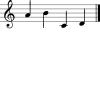

Overview
===============================================

This page provides an overview of certain key concepts in the GUIDOEngine
Web API.  For all of the examples below, we assume that the base URL
of the server is ``http://faust.grame.org`` running on port ``8000``.

Basic server calls
------------------

To interpret gmn code ``gmn=[a%20b%20c%20d]``, one makes the following call to
the Guido Web Server:

.. parsed-literal::
  `http://faust.grame.org:8000/?gmn=[a%20b%20c%20d] <http://faust.grame.org:8000/?gmn=[a%20b%20c%20d]>`_

The output will use GUIDO server default settings for page and formatting
attributes (discussed in :ref:`defaults`), creating the result:

.. note::

   Correct URLs use %20 for whitespace.  However, most modern browsers
   will still interpret whitespace in a URL with whitespace.  For example,
   in most modern browsers, you can call:

     .. parsed-literal::
        `http://faust.grame.org:8000/?gmn=[a b c d] <http://faust.grame.org:8000/?gmn=[a%20b%20c%20d]>`_

   And it will get you a correct result.

It is sometimes the case that a call to the Guido Web Server needs additional
arguments.  For example, to get a page map, the page in question must be
specified.  This is done by appending those arguments to the URL.

.. parsed-literal::
  http://faust.grame.org:8000/?get=voicemap&voice=1

Resulting in::

  foo

For calls that require multiple arguments, the arguments can appear in any
order.  For example, the ``get=point`` call requires two arguments, an ``x``
and ``y`` coordinate for the point.  This can be either:

.. parsed-literal::
  http://faust.grame.org:8000/?get=point&x=10&y=50

or:

.. parsed-literal::
  http://faust.grame.org:8000/?get=point&y=50&x=10

Resulting in::

  foo

Server responses
----------------

The server responds with two forms of data: graphical data and textual data.
Graphical data will have a MIME type of ``image/png``, ``image/jpeg``,
``image/gif`` or ``image/svg+xml`` depending on the format specified in
the URL.  Textual data will always be returned in JSON and thus the MIME
type is ``application/json``.

Multiple server calls in a single URL
-------------------------------------

All server calls in a single URL apply to the same GRHandler. This will
either be an anonymous handler or a named handler, as discussed in the
section :ref:`anon-named`.

Multiple calls are interpreted from left to right. The server responds to the
last valid call. All extra arguments for a given call to a server must be
specified immediately after the call.  So:

.. parsed-literal::
  http://faust.grame.org:8000/?gmn=[a%20b]&get=point&x=10&y=50

Will return::

By reversing the calls:

.. parsed-literal::
  http://faust.grame.org:8000/?get=point&x=10&y=50&gmn=[a%20b]

We receive::

Note that the result is different in the two calls.  In the first, the point
gotten corresponds to the previously specified gmn code ``gmn=[a%20b]``,
whereas in the second example the ``get=point`` applies to the default
``gmn`` (``[a]``), as no ``gmn`` has been specified yet.

GET and POST calls to the server
--------------------------------

Corrupt URLs
------------

Corrupt URLs for the GUIDOEngine Web Server come in many shapes and sizes.

- a
- b
- c 

.. _anon-named:

Anonymous versus named sessions
-------------------------------

A named session is created by inserting a name composed of only letters and
numbers in between the base URL of the Guido server and the subsequent
arguments (if any).  For example, we can instantiate the named session
for name ``ensemble101`` with ``gmn=[a b c d]`` by calling:

  .. http://faust.grame.org:8000/ensemble101?gmn=[a b c d]

When a named session is created, a GRHandler object is created that corresponds
to the session's name.  This GRHandler retains all information about that
session.  So, for example, if one calls::

  http://faust.grame.org:8000/ensemble101?get=gmn

The result will be::

  [a b c d]

